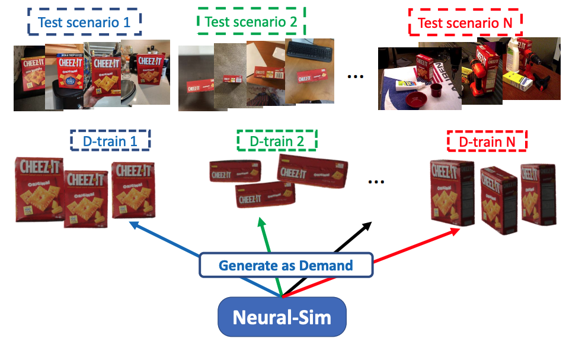
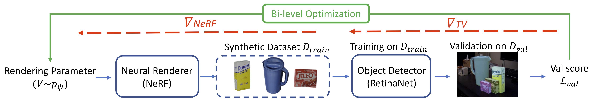

# Neural-Sim: Learning to Generate Training Data with NeRF

[ECCV 2022] [Neural-Sim: Learning to Generate Training Data with NeRF](https://arxiv.org/pdf/2207.11368.pdf)

Code are actively updating, thanks!

## Overview
The code is for On-demand synthetic data generation: Given a target task and a
test dataset, our approach “Neural-sim” generates data on-demand using a fully
differentiable synthetic data generation pipeline which maximises accuracy for
the target task.
<div align="center">
    
</div>


Neural-Sim pipeline: Our pipeline finds the optimal parameters for generating views from a trained neural renderer (NeRF) to use as training data for
object detection. The objective is to find the optimal NeRF rendering parameters ψ that can generate synthetic training data Dtrain, such that the model
(RetinaNet, in our experiments) trained on Dtrain, maximizes accuracy on a
downstream task represented by the validation set Dval

<div align="center">
    
</div>

## 1 Installation

Start by cloning the repo:

```bash
git clone https://github.com/gyhandy/Neural-Sim-NeRF.git
```


1 install the requirement of nerf-pytorch
```bash
pip install -r requirements.txt
```

2 install [detectorn2](https://detectron2.readthedocs.io/en/latest/tutorials/install.html)

## 2 NeRF models and dataset

You could train nerf with instructions [NeRF-pytorch](https://github.com/yenchenlin/nerf-pytorch)

For quick start, you could download our pretrained NeRF models and created sample dataset with BlenderProc
[here](http://ilab.usc.edu/andy/dataset/ycb_syn_data_and_nerfmodel.zip). Then unzip it and place in `.logs`. 
(Note: if not download automatically, please right click, copy the link and open in a new tab.)


### 3 Neural_Sim Bilelve optimization pipeline

```bash
cd ./optimization
```

Please use the neural-sim_main.py to run the end-to-end pipeline. E.g.,

```bash
python neural_sim_main.py --config ../configs/nerf_param_ycbv_general.txt --object_id 2 --expname exp_ycb_synthetic --psi_pose_cats_mode 5 --test_distribution 'one_1'
```
'--config' indicates the NeRF parameter

'--object_id' indicates the optimized ycbv object id, here is cheese box

'--expname' indicates the name of experiment

'--psi_pose_cats_mode' indicates the bin number of starting pose distribution during training

'--test_distribution' indicates the bin number of test pose distribution


## Contact / Cite
You may cite us in your research as:
```
@article{ge2022neural,
  title={Neural-Sim: Learning to Generate Training Data with NeRF},
  author={Ge, Yunhao and Behl, Harkirat and Xu, Jiashu and Gunasekar, Suriya and Joshi, Neel and Song, Yale and Wang, Xin and Itti, Laurent and Vineet, Vibhav},
  journal={arXiv preprint arXiv:2207.11368},
  year={2022}
}
```